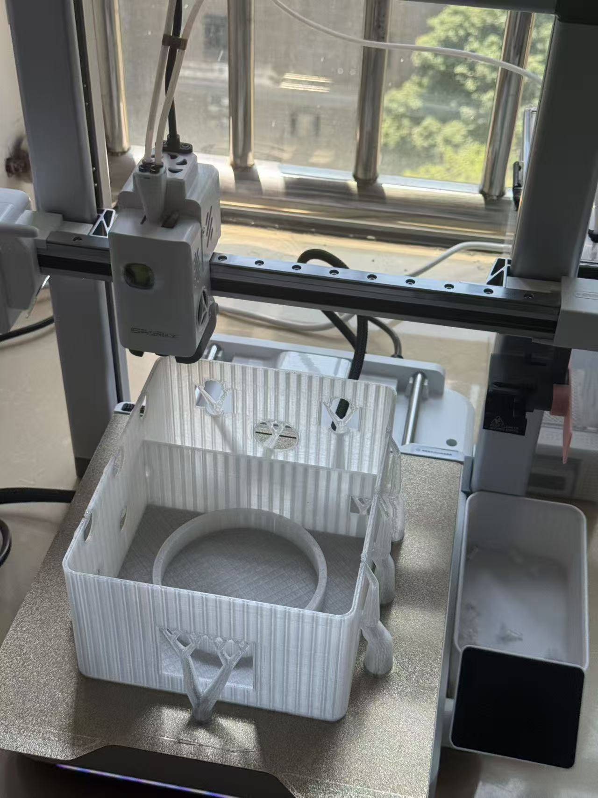
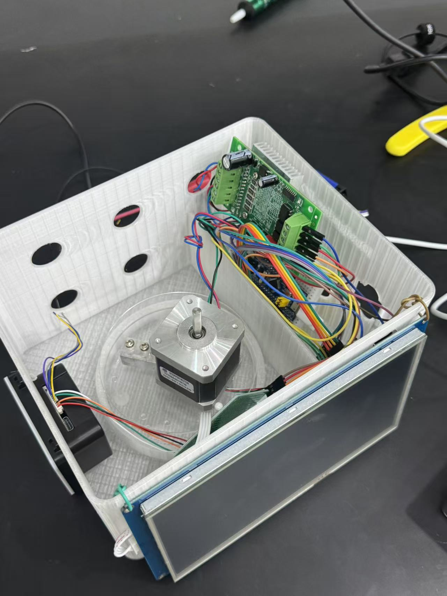
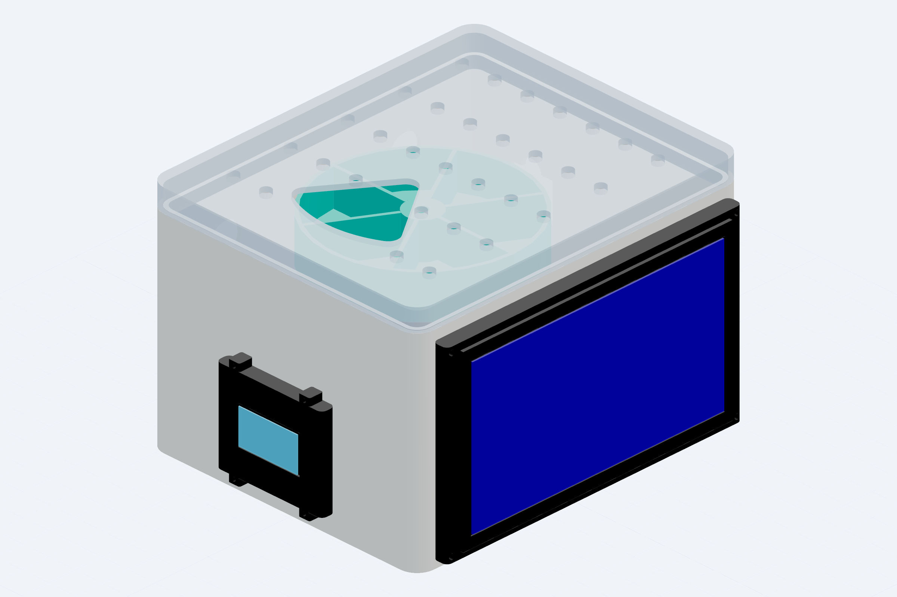
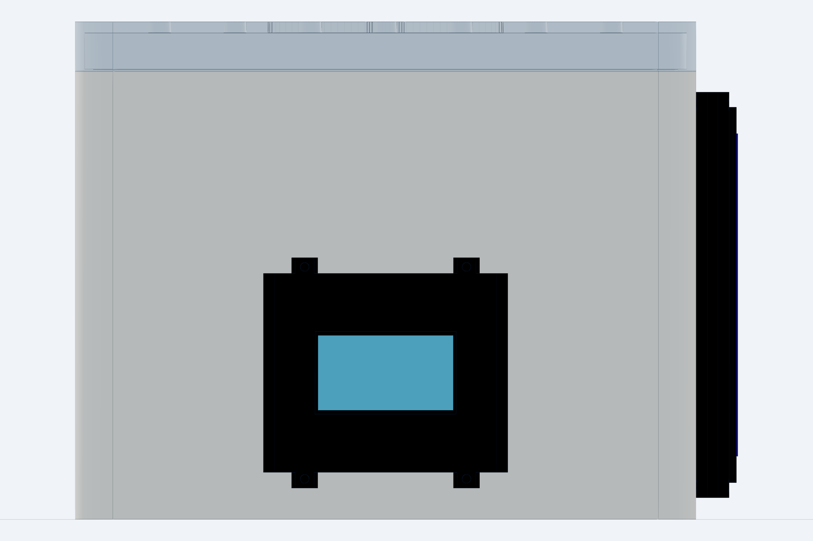
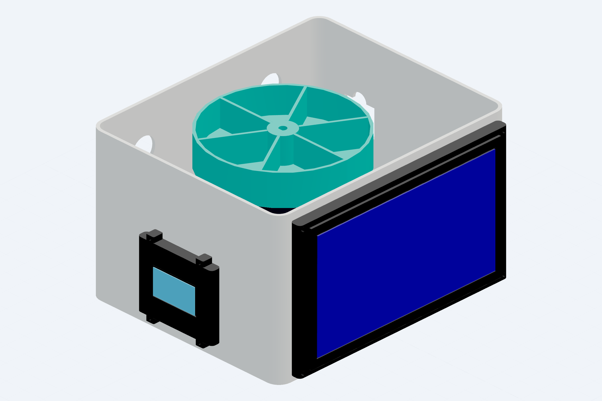

# 自动分药系统（Smart Pillbox）

基于 STM32 的自动分药系统，由 Android 应用、STM32 固件、Bluetooth SPP/RFCOMM 通信和参数化外壳组成。仓库包含 CadQuery/Python 参数化模型源文件及 STEP/STL 三维模型。


## 实物与结构展示

### 实物原型

系统装配完成后的整体外观，包含分药转盘、显示屏和扫码区域。


### 外壳打印

参数化外壳的打印与装配效果。



### 内部电子器件

内部控制板、蓝牙模块、称重模块及其他外设的安装状态。



### 三维结构总览

CAD 模型展示系统整体结构与各部件的空间关系。



### 正面扫码与显示区域

正面视图展示 QR100 扫码器、显示屏和人机交互区域。



### 内部布局

CAD 剖视布局展示转盘、电子器件与外壳内部的安装关系。



## 系统组成

系统由 Android 应用、STM32 固件、Bluetooth SPP/RFCOMM 通信链路和参数化外壳构成，实现定时提醒、自动出药、称重检测、漏服记录与手机端管理等完整功能。

## 核心功能

- Android `BleManager` 基于标准 SPP UUID，通过 RFCOMM Socket 完成蓝牙扫描、连接、自动重连与分行数据收发，下发 `TIME`、`PLAN`、`SET`、`MOTOR`、`SYNC` 五类控制命令。
- STM32 固件 `src/protocol.c` 实现命令解析与分派，驱动 HMI/OLED 显示、QR100 扫码、HX711 称重、蜂鸣器提醒和步进电机出药机构。
- 步进电机转盘支持 6 仓位定位，采用最短路径算法与相对位置追踪。
- HX711 称重模块通过滑动平均滤波与零点校准实现取药检测，重量下降超过阈值即判定为已服药。
- 服药记录持久化存储于 STM32 内部 Flash，循环写入并带校验和，上电自动恢复。
- PlatformIO 支持 `bluepill_f103c8` 固件构建，配套电机命令静态检查脚本与仓库规范单元测试。

## 目录结构

| 路径 | 内容 |
| --- | --- |
| `android/` | Android Studio/Gradle 应用源码（Kotlin）。 |
| `firmware/` | STM32Cube HAL、PlatformIO 工程、通信协议与外设驱动源码。 |
| `mechanical/src/` | CadQuery/Python 参数化模型源文件。 |
| `mechanical/models/` | STEP/STL 三维模型文件，可直接用于 3D 打印。 |
| `docs/` | [系统架构](docs/architecture.md)、[通信协议](docs/protocol.md) 及配图。 |
| `tests/` | 仓库规范检查脚本与单元测试。 |

## 构建与验证

### 固件构建（PlatformIO）

```powershell
cd firmware
pio run
python tools_check_motor_command.py
```

### Android 应用构建

需配置 JDK 与 Android SDK 环境后执行：

```powershell
cd android
.\gradlew.bat test
```

### 仓库规范检查

```powershell
python -m unittest discover -s tests -v
```

固件构建、电机命令静态检查与全部 6 项仓库规范单元测试均通过。

## 许可证与版权

软件源码（`android/`、`firmware/`）采用 MIT License；硬件/CAD（`mechanical/`）采用 CERN-OHL-P-2.0。完整法律文本在 [`LICENSES/`](LICENSES/)。实物照片和说明文字由作者保留版权，除非另有书面许可。
