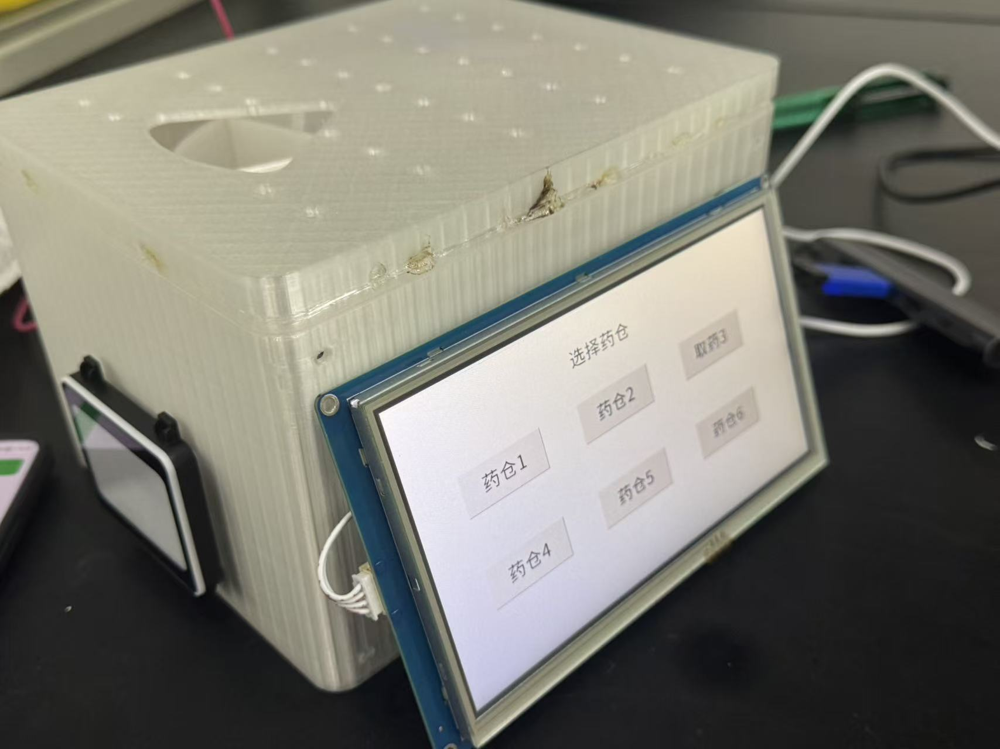

# Smart Pillbox

Smart Pillbox is an independently developed course prototype for a connected medication box.
The Android app communicates with STM32 firmware over classic Bluetooth SPP/RFCOMM.
CadQuery/Python sources and representative STEP/STL outputs are included for reproducible CAD work.
This repository documents verified source-level behavior; it is not a certified medical device.

## 项目定位

这是**独立开发的课程原型**，用于展示 Android、嵌入式固件、串口协议和参数化结构设计的组合。仓库中的实物照片来自原型装配，CAD 图片是模型渲染，不应混同为实测尺寸或量产外观。



## 已核实能力

- Android `BleManager` 使用标准 SPP UUID，通过 RFCOMM socket 扫描、连接、重连、分行收发数据，并生成 `TIME`、`PLAN`、`SET`、`MOTOR`、`SYNC` 命令。
- STM32 `src/protocol.c` 分派并处理上述五类命令；固件包含 HMI/OLED、QR100、HX711、蜂鸣器和步进电机驱动路径。
- PlatformIO 可完成 `bluepill_f103c8` 的 debug 构建；静态电机命令检查可重复运行。

## 目录

| 路径 | 内容 |
| --- | --- |
| `android/` | Android Studio/Gradle 应用源码（未包含本机 SDK 配置）。 |
| `firmware/` | STM32Cube HAL、PlatformIO 工程、协议与驱动源码。 |
| `mechanical/src/` | CadQuery/Python 参数化模型源。 |
| `mechanical/models/` | 精选代表性 STEP/STL 输出。 |
| `docs/` | [架构](docs/architecture.md)、[协议](docs/protocol.md) 和图片。 |
| `tests/` | 发布仓库结构与敏感文件审计。 |

## 构建与验证

在仓库根目录执行：

```powershell
cd android
.\gradlew.bat test
cd ..\firmware
pio run
python tools_check_motor_command.py
cd ..
python -m unittest discover -s tests -v
```

本次发布（2026-08-06，Windows）实际结果：

- `.\gradlew.bat test`：**未执行到 Gradle**，退出码 1；环境没有 `JAVA_HOME`，且 PATH 中找不到 `java`。
- `pio run`：**成功**，退出码 0；生成 BluePill F103C8 debug 固件。编译器报告 3 条既有未使用函数/宏重定义警告（`src/motor.c`、`src/oled.c`、`src/rtc_ds3231.c`）。构建目录已删除，未纳入仓库。
- `python tools_check_motor_command.py`：**成功**，输出 `motor command static checks passed`。
- `python -m unittest discover -s tests -v`：**成功**，6/6 tests passed；该审计禁止本机状态、备份、隐藏 GLB、构建产物、绝对路径和超过 5 MB 文件。

## 已知限制

- 未在真实 Android 设备、JDY-31、STM32 板卡和外设组合上做本次发布的端到端回归；Android 构建因缺少 Java 环境未运行。
- `FEATURE_DS3231_RTC` 与 `FEATURE_OPTICAL_SENSORS` 当前为 0；时间依赖手机 `TIME` 同步，步进电机没有光学回零传感器。
- SPP 文本协议没有版本、认证或加密；药品名称、计划和记录是课程演示级数据，不提供医疗安全保证。
- `mechanical/models/` 是代表性输出，不承诺所有历史参数变体、打印公差或装配配合。

## 许可证与版权

软件源码（`android/`、`firmware/`）采用 MIT License；硬件/CAD（`mechanical/`）采用 CERN-OHL-P-2.0。完整法律文本在 [`LICENSES/`](LICENSES/)。实物照片和本仓库 prose 为作者保留版权，除非另有书面许可。
